# 📊 Statistics Notes

Personal statistics notes, rebuilt from handwritten lecture notes (29 Mar – 18 Apr 2026) into a quick-recall reference. Each topic file includes a diagram, the core formulas, a worked numeric example, and a quick-recall Q&A section for fast review before interviews or exams.

## How to use this repo

Each file is self-contained — jump straight to the topic you need. Diagrams are [Mermaid](https://mermaid.js.org/) (render natively on GitHub); formulas use GitHub's native math rendering (`$...$` / `$$...$$`).

## Topics

| # | Topic | Covers |
|---|---|---|
| 1 | [Population, Sample & Variables](topics/01-population-sample-variables.md) | Population vs sample, parameter vs statistic, data types (continuous/discrete/categorical/binary) |
| 2 | [Central Tendency](topics/02-central-tendency.md) | Mean, median, mode — when to use which |
| 3 | [Dispersion: Variance & SD](topics/03-dispersion-variance-sd.md) | Variance, standard deviation, Bessel's correction (n−1), degrees of freedom |
| 4 | [Percentiles, Quartiles & Outliers](topics/04-percentiles-quartiles-outliers.md) | Percentile formulas, quartiles, IQR, box plots, the fence method |
| 5 | [Skewness & Kurtosis](topics/05-skewness-kurtosis.md) | Distribution shape, left/right skew, tail heaviness |
| 6 | [Probability Basics & Sets](topics/06-probability-basics-sets.md) | Sets, set operations, random variables, probability rules, conditional probability |
| 7 | [Covariance & Correlation](topics/07-covariance-correlation.md) | Measuring relationships between two variables |
| 8 | [Probability Distributions](topics/08-probability-distributions.md) | PMF, CDF, PDF, Bernoulli, Binomial, Poisson, Uniform, Exponential |
| 9 | [Normal Distribution & Z-Score](topics/09-normal-distribution-zscore.md) | The bell curve, empirical rule (68-95-99.7), z-scores |
| 10 | [CLT & Hypothesis Testing](topics/10-clt-hypothesis-testing.md) | Central Limit Theorem, standard error, z-statistic, significance level, p-values, one/two-tailed tests |

## Suggested reading order

```mermaid
flowchart LR
    T1["1. Foundations"] --> T2["2. Central Tendency"]
    T2 --> T3["3. Dispersion"]
    T3 --> T4["4. Percentiles/Outliers"]
    T4 --> T5["5. Skewness/Kurtosis"]
    T5 --> T6["6. Probability Basics"]
    T6 --> T7["7. Covariance/Correlation"]
    T7 --> T8["8. Distributions"]
    T8 --> T9["9. Normal Dist/Z-score"]
    T9 --> T10["10. Hypothesis Testing"]
```

Topics 1–5 build the descriptive-statistics toolkit (summarizing data you already have). Topics 6–10 build the inferential-statistics toolkit (using a sample to draw conclusions about a population) — this is the path most stats/data-science courses follow, and it's the order these lectures were originally taught in.
