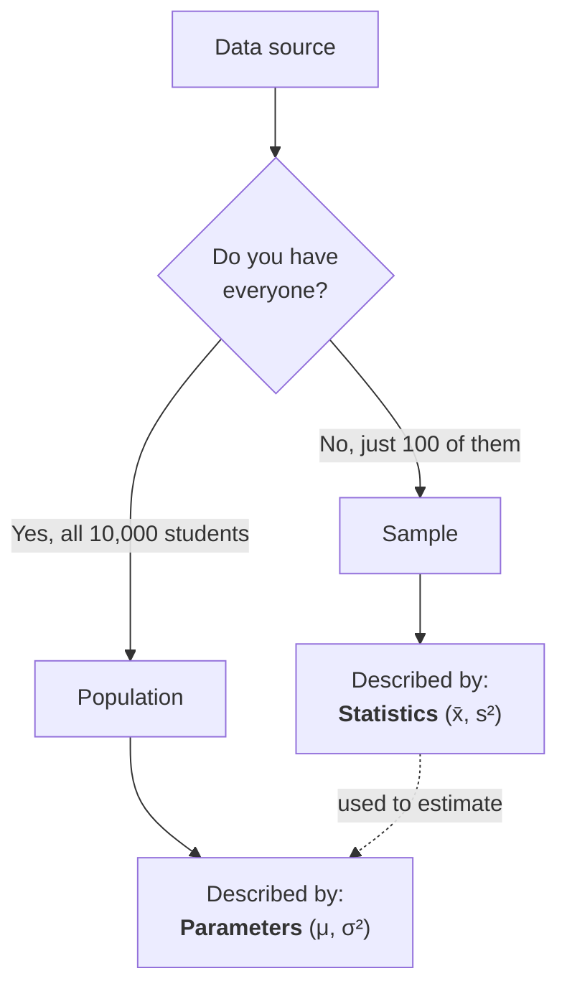
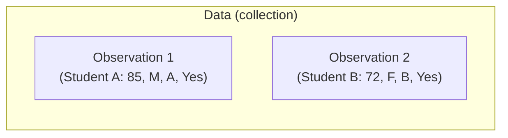
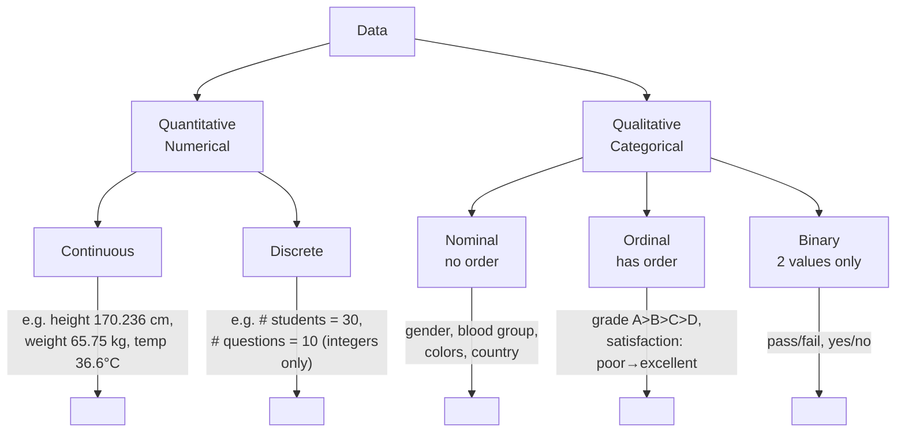

# Population, Sample & Variables

> **Lecture source:** 29-Mar-2026, 01-Apr-2026
> Foundational vocabulary — every other topic in this repo builds on these definitions.

## TL;DR

Statistics is the domain of math/science focused on **collecting, organizing, analyzing, and interpreting data to make decisions**. Before you compute anything, you must know: are you looking at the *whole group* (population) or a *slice of it* (sample), and is each column *numbers* or *labels*?



## Population vs. Sample

| | Population | Sample |
|---|---|---|
| Definition | The **entire** group you care about | A **smaller part** of the population |
| Example | All 10 students in a class | 5 of those 10 students |
| Described by | **Parameter** (e.g. population mean `μ`) | **Statistic** (e.g. sample mean `x̄`) |
| Symbol convention | Greek letters: `μ`, `σ`, `σ²` | Roman/hat letters: `x̄`, `s`, `s²` |

> **Key rule of thumb:** the bigger the sample, the better the estimate of the population.

### Worked example
A course has **1,000 students** (population). You only have live attendance data for **100 students** (sample).
- Population average age → the *true* value, call it `μ`
- Sample average age (from the 100) → your *estimate*, `x̄`
- `x̄` is not guaranteed to equal `μ` — that gap is called **sampling error**, and it shrinks as sample size grows.

### Quick-recall Q&A
- **Q: What's the difference between a parameter and a statistic?**
  A: A parameter describes the population (fixed, usually unknown); a statistic describes a sample (computed, used to estimate the parameter).
- **Q: Why do we sample instead of measuring the whole population?**
  A: Measuring everyone is often too expensive, slow, or impossible — a well-chosen sample gives a good estimate for a fraction of the cost.

---

## Variables, Data & Observations

- **Variable** → something we measure (height, marks, rank)
- **Observation** → one single data point (one row: e.g. student S1 → height h1)
- **Data** → the full collection of observations (name, height, weight, age, ...)



## Types of Data (the full taxonomy)



| Type | Sub-type | Can you average it? | Example |
|---|---|---|---|
| **Continuous** | Quantitative | Yes | Height = 170.236 cm (infinite precision within a range) |
| **Discrete** | Quantitative | Yes (careful with interpretation) | Number of students = 30 (never 25.5 students) |
| **Nominal** | Categorical, no order | No | Gender: M/F, Color: Red/Blue |
| **Ordinal** | Categorical, ordered | No (but can rank) | Grade: A > B > C > D |
| **Binary** | Categorical, 2 values | No | Pass/Fail, Yes/No |

### Continuous data — the "infinite values" idea
```
0, 1, 2, 3 ... 100        → 101 possible values
0, 0.1, 0.2, ... 1        → 11 possible values
0, 0.01, 0.02, 0.03 → 0.1 → 11 possible values
0, 0.001, 0.002, ...      → infinite precision
```
The more decimal places you allow, the more values are possible in the same range — that's what makes data "continuous."

### Quick-recall Q&A
- **Q: Is "number of questions answered correctly" discrete or continuous?**
  A: Discrete — it's countable, only integers make sense (you can't answer 2.5 questions).
- **Q: Nominal or ordinal — "Star rating ⭐ to ⭐⭐⭐⭐⭐"?**
  A: Ordinal — there's a clear order (more stars = better), even though the gap between ratings isn't precisely measurable.
- **Q: Why can't you rank nominal data?**
  A: Because there's no inherent order — saying "Male > Female" or "Red > Blue" is meaningless.
