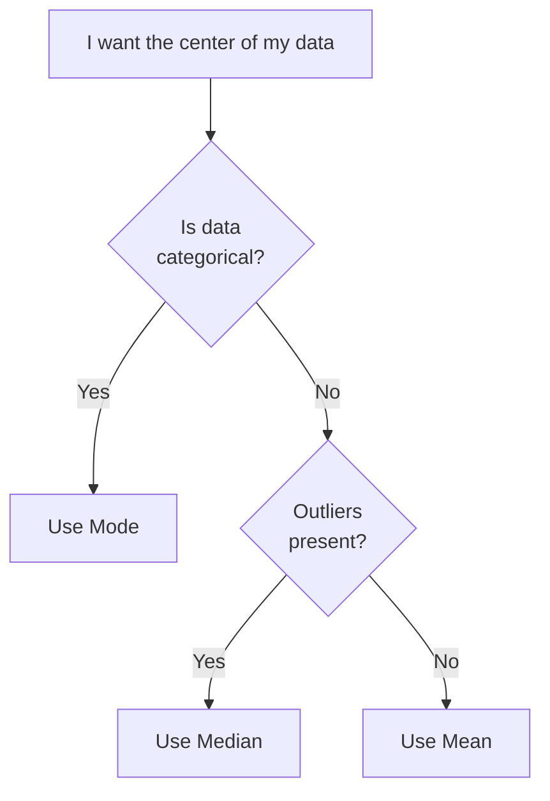
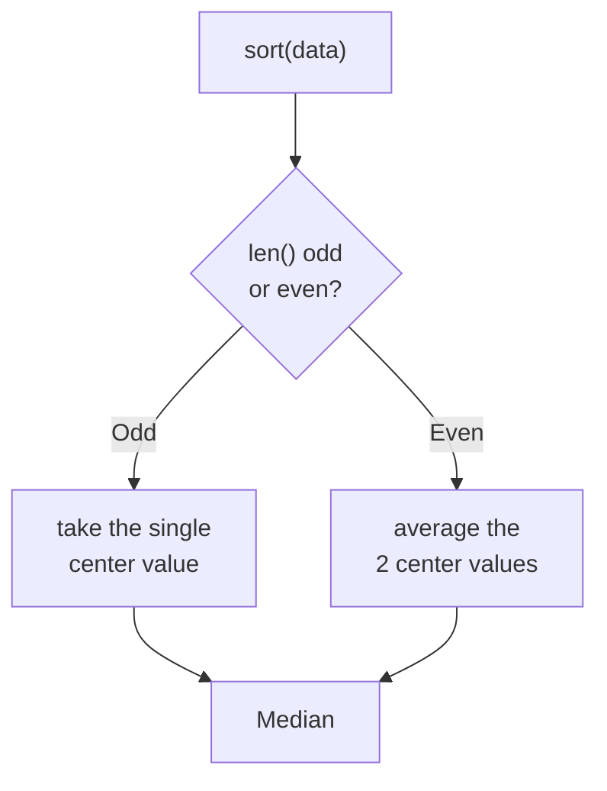

# Measures of Central Tendency (Mean, Median, Mode)

> **Lecture source:** 01-Apr-2026
> Goal: find the single number that best represents the "center" of your data.

## TL;DR

## 1. Mean (average)

$$\text{mean} = \bar{x} = \frac{\sum x_i}{n}$$

**Worked example:** Marks = [10, 20, 30] → mean = (10+20+30)/3 = **20**

### The drawback: mean is sensitive to outliers
| Dataset | Values | Sum/n | Mean |
|---|---|---|---|
| A | 10, 20, 40, 50 | 120/4 | **30** |
| B | 10, 20, 40, 90 | 160/4 | **40** |
| C | 10, 20, 40, 60 | 130/4 | **32.5** |
| D | 10, 20, 40, **500** | 570/4 | **142.5** ⚠️ outlier drags the mean far away |

> One extreme value (500 in dataset D) can shift the mean dramatically — the mean "chases" outliers.

## 2. Median (middle value)

Sort the data, take the middle value.

**Worked example:** `sort(A) = [10,30,40,40,50,50,55,60,80]`, `len = 9` (odd) → median = the 5th value = **50**

If `len` were even, e.g. `[10,30,40,40,50,50,55,60,80,80]` (10 values) → median = average of the two center values = (50+50)/2 = **50**

### Median resists outliers
`[10,30,40,40,50,50,55,60,80, 8000]` → median is still **50** (only the mean would blow up to ~840).

## 3. Mode (most frequent value)

Works for **categorical** data where mean/median make no sense.

**Worked example:** Sports team results `A, B, A, B, A, B, C, C, C, C` → frequency: A=3, B=3, C=4 → **mode = C** (won the most games)

## Choosing between them — cheat table

| Shape of data | Best center measure | Why |
|---|---|---|
| Clean numeric, no outliers | **Mean** | Uses every value, most precise |
| Numeric with outliers | **Median** | Not affected by extreme values |
| Categorical / labels | **Mode** | Mean/median are meaningless on labels |

### Quick-recall Q&A
- **Q: Dataset = [10, 20, 30, 1000] — which center measure should you trust?**
  A: Median (≈25) — the mean (~265) is dragged wildly by the outlier 1000.
- **Q: Can you compute the mean of `[Red, Blue, Green]`?**
  A: No — mean requires numeric data. Use mode instead.
- **Q: If two datasets have the same mean, are they the same "shape"?**
  A: Not necessarily — e.g. `[50,51,49,50,52]` and `[0,100,10,90,50]` both average to 50 but have very different spreads (see [Dispersion](03-dispersion-variance-sd.md)).
