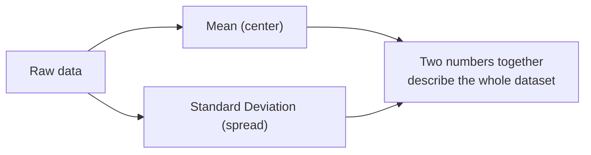
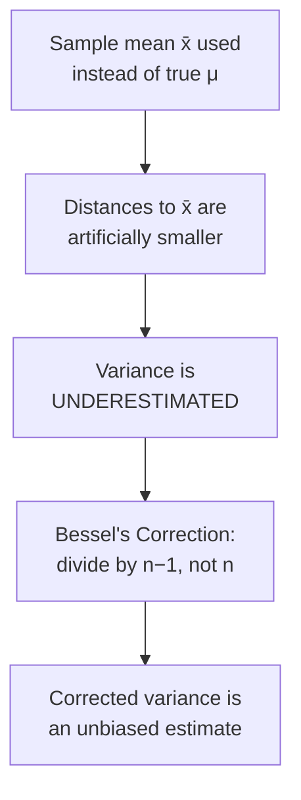

# Dispersion: Variance, Standard Deviation & Bessel's Correction

> **Lecture source:** 01-Apr-2026, 04-Apr-2026
> Central tendency tells you *where* the center is. Dispersion tells you *how spread out* the data is around that center.

## TL;DR

Mean answers "what's typical?" Standard deviation answers "how far do points typically stray from typical?"



## Variance — the intuition

Analogy from the notes: "spread = 2 hands" — if you want the *common* spread between people's heights, you average how far each person is from the mean.

$$\text{variance} = \sigma^2 = \frac{\sum (x_i - \mu)^2}{n}$$

Why **squared**? Because raw differences `(x_i - μ)` sum to **zero** by definition (that's a mathematical fact, not a choice) — squaring removes the direction (+/-) so distances don't cancel out.

**Worked example:** Series = [10, 20, 30], mean = 20
| xᵢ | xᵢ − μ | (xᵢ − μ)² |
|---|---|---|
| 10 | −10 | 100 |
| 20 | 0 | 0 |
| 30 | 10 | 100 |

variance = (100+0+100)/3 = **66.67 units²** ← notice the squared unit (e.g. inch²), which is hard to interpret.

## Standard Deviation — fixing the units problem

$$\sigma = \sqrt{\sigma^2}$$

$$\sigma = \sqrt{66.67} \approx 8.16$$

Now the unit matches the data again (inches, not inches²). **Interpretation:** "on average, numbers deviate from the mean by 8.16."

```
[10, 20, 30]  →  mean = 20, SD ≈ 8.16
   10          20          30
  (20-8.16)         (20+8.16)
  = 11.84            = 28.16
```

## Population variance vs. Sample variance — the `n` vs `n−1` question

$$\text{Population: } \sigma^2 = \frac{\sum (x_i - \mu)^2}{n} \qquad \text{Sample: } s^2 = \frac{\sum (x_i - \bar{x})^2}{n-1}$$

### Why does the sample formula divide by `n−1` instead of `n`?

**The problem (bias):** When you compute variance using a *sample mean* (`x̄`) instead of the *true population mean* (`μ`), you systematically **underestimate** the true spread. This is because `x̄` is calculated *from the same data* you're measuring spread on — the data point closest to `x̄` will always look "less spread out" than it would relative to the true `μ`.

**The fix — Bessel's Correction:** Divide by a smaller number (`n−1`) to inflate the result just enough to cancel out the underestimate.



### Why `n−1` specifically? — Degrees of Freedom

**Fact:** `Σ(xᵢ − x̄) = 0` always (it's a mathematical identity, not an assumption).

That means if you know `n−1` of the deviations, the **last one is forced** — it has no freedom to vary.

**Worked example:** 5 people, sample mean = 163
```
x1 + x2 + x3 + x4 + x5 = 815   (forced total, since mean × n = 815)
200 + 100 + 300 + 100 + x5 = 815
700 + x5 = 815  →  x5 = 115  (forced — not free!)
```
→ 4 values are "free" to be anything, 1 is "locked in" by the mean constraint → **degrees of freedom = n − 1 = 4**

| | Population | Sample |
|---|---|---|
| Mean used | True `μ` (external, fixed) | `x̄` (derived from data) |
| Values "free" to vary | all `n` | only `n − 1` |
| Divide by | `n` | `n − 1` |
| Why | No bias — μ isn't derived from the same data | Corrects the bias from using a derived mean |

### Quick-recall Q&A
- **Q: You compute variance on a sample and forget to use `n−1`. What happens?**
  A: You underestimate the true population variance — your spread looks smaller than it really is.
- **Q: What are "degrees of freedom" in one sentence?**
  A: The number of values in a sample that are free to vary once the mean is fixed — always `n − 1`.
- **Q: If SD = 8.16 for a dataset in inches, what's the unit of variance?**
  A: inches² (squared) — which is why we take the square root to get back to interpretable units.
