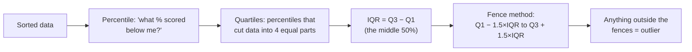
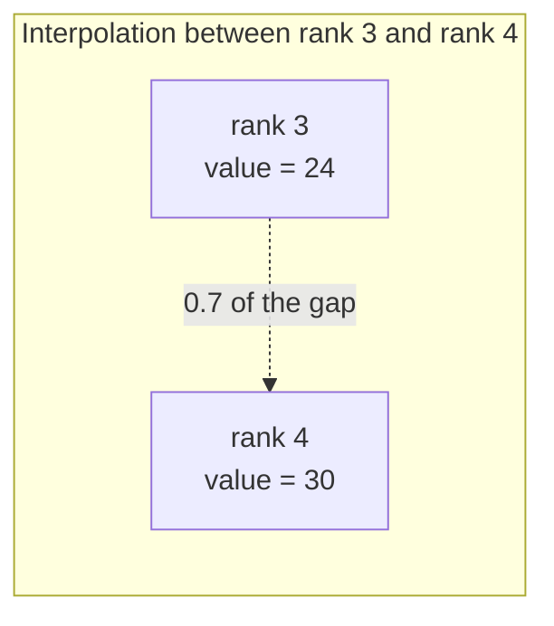
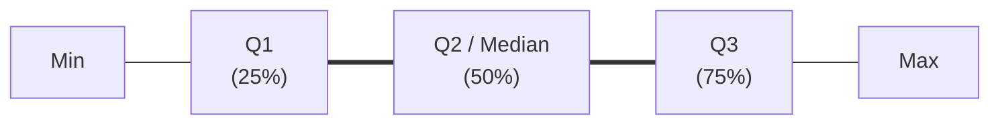

# Percentiles, Quartiles, IQR & Outlier Detection

> **Lecture source:** 04-Apr-2026, 05-Apr-2026

## TL;DR



## Percentage vs. Percentile

| | Percentage | Percentile |
|---|---|---|
| Question answered | "What fraction of the total is this?" | "What % of the group scored *below* me?" |
| Formula | `% = (part / total) × 100` | rank-based, see below |
| Example | You scored 50/100 → 50% | You're at the 96th percentile → 96% of people scored below you |

> A CAT exam percentile of 99% means 99% of test-takers scored below you — **not** that you got 99% of questions right.

## Computing a percentile — two formulas

### Formula 1: Nearest Rank
$$L = \lceil \frac{P}{100} \times n \rceil$$
Take the ceiling, then pick the `L`-th value from the sorted list.

**Worked example:** data (sorted, n=10) = `[12,18,24,30,35,41,47,55,63,70]`, find 30th percentile
`L = 0.30 × 10 = 3` → 3rd value = **24**

### Formula 2: Linear Interpolation (most common — this is what NumPy/pandas use by default)
$$L = \frac{P}{100} \times (n-1) + 1$$

**Worked example:** same data, 30th percentile
`L = 0.30 × 9 + 1 = 3.7` → the "3.7th" position, i.e. 70% of the way from the 3rd value (24) to the 4th value (30)
`= 24 + 0.7 × (30 − 24) = 24 + 4.2 = 28.2`



## Quartiles — percentiles that split data into 4 equal parts

| Quartile | Percentile | Meaning |
|---|---|---|
| **Q1** | 25th | 25% of data lies below this point |
| **Q2** | 50th | the **median** |
| **Q3** | 75th | 75% of data lies below this point |

$$\text{IQR (Interquartile Range)} = Q_3 - Q_1$$

IQR = the region/width where the **bulk of the data lives** (the middle 50%), ignoring extreme tails.

## Box Plot anatomy


`|---[ Q1 | Q2 | Q3 ]---|   ○ ○ ○` (circles = outliers plotted separately)

## Outlier Detection — The Fence Method (Tukey's method)

$$\text{Lower fence} = Q_1 - 1.5 \times IQR \qquad \text{Upper fence} = Q_3 + 1.5 \times IQR$$

Anything **outside** the fences is flagged as an outlier. The constant `1.5` was proposed by statistician **John Tukey**.

### Worked example
Data (n=15, sorted): `4, 8, 12, 15, 18, 21, 24, 27, 30, 33, 38, 42, 47, 51, 94`

1. Q1 (25th pctile): `L = 0.25×14 + 1 = 4.5` → interpolate between rank 4 (15) and rank 5 (18) → `15 + 0.5×3 = 16.5`
2. Q3 (75th pctile): `L = 0.75×14 + 1 = 11.5` → interpolate between rank 11 (38) and rank 12 (42) → `38 + 0.5×4 = 40`
3. IQR = 40 − 16.5 = **23.5**
4. Lower fence = 16.5 − 1.5×23.5 = **−18.75**
5. Upper fence = 40 + 1.5×23.5 = **75.25**

→ **94** is outside the upper fence (75.25) → **94 is an outlier**.

```python
import numpy as np
data = np.array([4,8,12,15,18,21,24,27,30,33,38,42,47,51,94])
q1, q3 = np.percentile(data, [25, 75])
iqr = q3 - q1
lower, upper = q1 - 1.5*iqr, q3 + 1.5*iqr
mask = (data >= lower) & (data <= upper)
clean_data = data[mask]      # remove outliers
outliers    = data[~mask]    # keep only outliers
```

## Why remove outliers? (and why you might not want to)

- Outliers can distort means, inflate variance, and confuse ML models trying to learn "normal" patterns.
- **But:** removing an outlier also removes potentially real, important information. A fraud transaction or a rare disease case *is* an outlier — deleting it could bias your model toward "everything is normal," which defeats the model's purpose. Always ask *why* the value is extreme before deleting it.

### Quick-recall Q&A
- **Q: What does IQR measure, in one sentence?**
  A: The width of the middle 50% of the data — where the bulk of it lives.
- **Q: A value equals exactly Q3 + 1.5×IQR. Is it an outlier?**
  A: No — the fence method flags values *strictly outside* the fences, this one sits right on the boundary.
- **Q: Why might blindly removing all outliers hurt a fraud-detection model?**
  A: Because the outliers (unusual transactions) are often exactly the pattern the model is trying to learn — removing them removes the signal.
