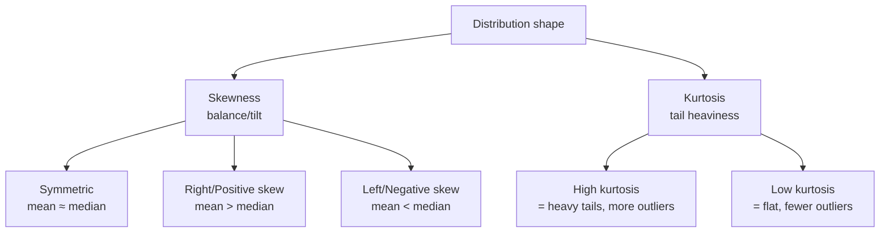
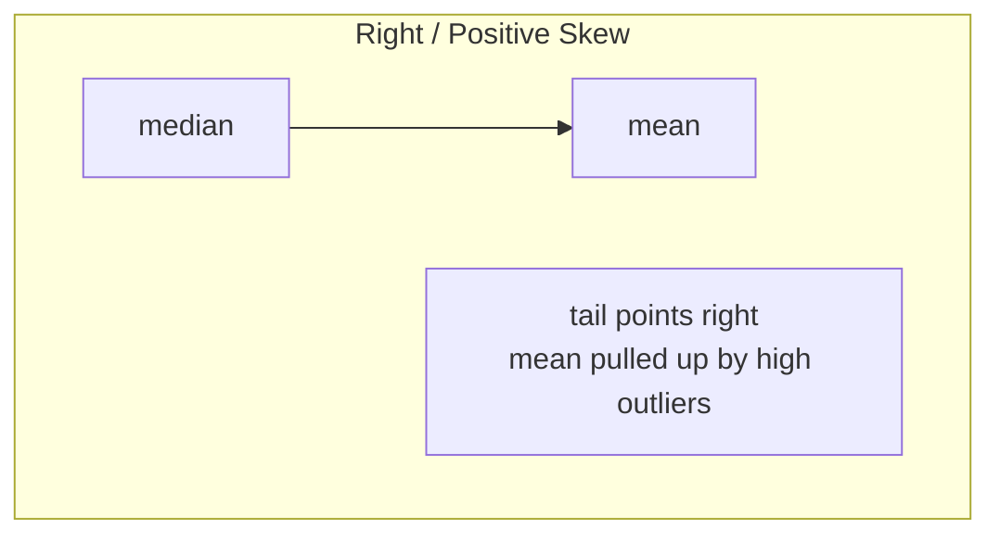

# Skewness & Kurtosis — Understanding Distribution Shape

> **Lecture source:** 05-Apr-2026

## TL;DR

Skewness asks: **"is my data balanced or tilted to one side?"**
Kurtosis asks: **"are extreme values common or rare?"**



## Skewness

$$\text{skewness} = \frac{\sum (x_i - \mu)^3}{n \cdot \sigma^3}$$

Cubing (not squaring) preserves the **sign** — so skewness can be positive or negative, telling you *which direction* the tail stretches.

### The three cases

| Case | Marks example | Mean vs Median | Shape |
|---|---|---|---|
| **Balanced (symmetric)** | 40, 50, 60, 70, 80 | mean = 60, median = 60 → **mean ≈ median** | Normal bell curve |
| **Right skew (positive)** | 10, 20, 30, 40, 90 | mean = 38, median = 30 → **mean > median** | Long tail stretches right |
| **Left skew (negative)** | 10, 60, 70, 80, 90 | mean = 62, median = 70 → **mean < median** | Long tail stretches left |



| Skew shape | Relationship | Skewness value |
|---|---|---|
| Balanced | Mean = Median | ≈ 0 |
| Tail Right (Positive) | Mean > Median | > 0 |
| Tail Left (Negative) | Mean < Median | < 0 |

> **Memory trick:** the skew "points" toward the tail, and the mean gets dragged toward that tail (because mean is sensitive to extreme values, unlike median).

## Kurtosis

$$\text{kurtosis} = \frac{\sum (x_i - \mu)^4}{n \cdot \sigma^4}$$

The question kurtosis answers: **"Are extreme values (outliers) common?"**

| Kurtosis value | Meaning | Distribution shape |
|---|---|---|
| ≈ 0 (mesokurtic) | Normal — outliers occur as expected | Standard bell curve |
| > 0 (leptokurtic) | Few but *big* outliers, sharp peak | Tall & narrow with heavy tails |
| < 0 (platykurtic) | Flat, thin tails, fewer extreme values | Flat / wide distribution |

### Why square vs. cube vs. 4th power?
- **Variance** uses `²` — removes direction, all deviations count equally
- **Skewness** uses `³` — *keeps* the direction, so you learn which way the data tilts
- **Kurtosis** uses `⁴` — heavily amplifies the effect of extreme values (a value twice as far from the mean contributes 16× more to kurtosis), which is exactly why it's good at detecting "tail heaviness"

### Note from lecture: kurtosis is a "hard to interpret / less reliable" measure
It's mentioned as a metric practitioners use cautiously — always sanity-check kurtosis against a histogram or box plot rather than trusting the number alone.

```python
from scipy.stats import skew, kurtosis
import numpy as np

data = np.array([10, 20, 30, 40, 90])
print("skewness:", skew(data))       # > 0 → right-skewed
print("kurtosis:", kurtosis(data))   # compare to 0 (excess kurtosis)
```

### Quick-recall Q&A
- **Q: Mean = 62, Median = 70. Which way is the data skewed?**
  A: Left (negative) skew — mean is pulled below the median by low-value outliers.
- **Q: Why does skewness use an odd power (³) and not an even one?**
  A: Even powers (like variance's ²) always produce positive numbers, erasing direction. An odd power preserves the sign so you can tell which side the tail is on.
- **Q: A histogram is very tall and narrow with a sharp peak. High or low kurtosis?**
  A: High (leptokurtic) — sharp peaks paired with heavy tails indicate more extreme values than a normal distribution.
