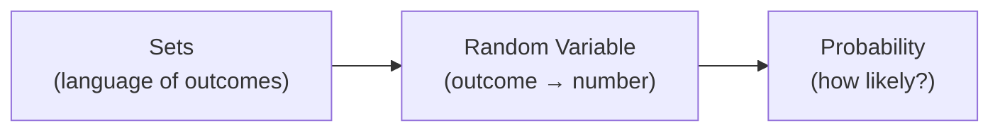
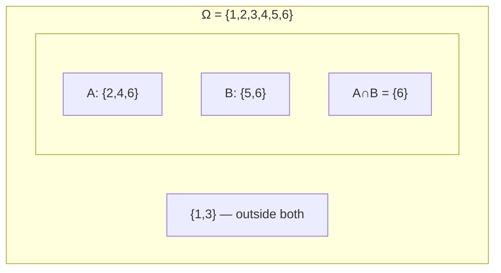

# Probability Basics: Sets, Random Variables & Rules

> **Lecture source:** 08-Apr-2026

## TL;DR

Sets are the *language* used to describe outcomes; probability is the *math* for measuring how likely those outcomes are.



## Sets — the language of outcomes

A **set** is a collection of distinct items. In probability, the full set of possible outcomes is the **sample space (Ω)**.

**Example — rolling a die:**
```
Sample space Ω = {1, 2, 3, 4, 5, 6}
Event A = "roll an even number" = {2, 4, 6}   ⊂ Ω
Event B = "roll greater than 4"  = {5, 6}      ⊂ Ω
Event C = "roll a 9"             = {}          → empty set ∅ (impossible event)
```
An **event** is just a subset of the sample space.

## The Four Set Operations

Given `A = {2,4,6}`, `B = {5,6}`, `Ω = {1,2,3,4,5,6}`:

| Operation | Symbol | Meaning | Formula | Result |
|---|---|---|---|---|
| **Union** | `A ∪ B` | A or B (everything in either, no duplicates) | `A + B − A∩B` | `{2,4,5,6}` |
| **Intersection** | `A ∩ B` | A and B (common to both) | — | `{6}` |
| **Complement** | `Aᶜ` | Not A | `Ω − A` | `{1,3,5}` |
| **Difference** | `A \ B` or `A − B` | In A but not in B | — | `{2,4}` |



## Random Variables

A **random variable (X)** is a function that converts an outcome into a number.

**Example — flip 2 coins, count heads:**
```
Outcomes:  HH, HT, TH, TT
X(HH) = 2,  X(HT) = 1,  X(TH) = 1,  X(TT) = 0
X can take values from the set {0, 1, 2}
```

| Random variable type | Definition | Examples |
|---|---|---|
| **Discrete** | Countable, separate values | heads in 2 flips, students absent, wickets taken |
| **Continuous** | Infinite possible values within a range | person height, exam start time, temperature |

## Probability — the basics

$$P(A) = \frac{\text{number of favorable outcomes}}{\text{total outcomes}}$$

**Example:** Toss 1 coin. `S = {H, T}`, Event A = `{H}` → `P(A) = 1/2 = 0.5` → 50% chance of heads.

### Core rules

| Rule | Formula | Meaning |
|---|---|---|
| **Complement rule** | `P(A') = 1 − P(A)` | Probability of "not A" |
| **Sum of all outcomes** | `Σ P(x) = 1` | All probabilities in a sample space add to 1 |
| **Addition rule (OR / union)** | `P(A∪B) = P(A) + P(B) − P(A∩B)` | Probability of A or B happening |
| **Conditional probability** | `P(A\|B) = P(A∩B) / P(B)` | Probability of A, *given B already happened* |

### Worked example — Addition Rule
Rolling a die: A = even number `{2,4,6}`, B = multiple of 3 `{3,6}`
```
P(A) = 3/6,  P(B) = 2/6,  P(A∩B) = 1/6  (only 6 is in both)
P(A∪B) = 3/6 + 2/6 − 1/6 = 4/6 = 2/3 ≈ 66.67%
```
→ 66.67% chance the roll is either even OR a multiple of 3.

### Worked example — Conditional Probability
Same die. `P(A|B)` = probability of rolling even, **given** we know the roll is a multiple of 3 (i.e. the roll is in `{3,6}`).
```
P(A|B) = P(A∩B) / P(B) = (1/6) / (2/6) = 1/2
```
→ Once you know it's a multiple of 3, there's a 50% chance it's also even (only 6 qualifies out of {3,6}).

```python
# quick simulation to sanity-check probability rules
import random
trials = 100_000
count_even_or_mult3 = sum(
    1 for _ in range(trials)
    if (r := random.randint(1,6)) % 2 == 0 or r % 3 == 0
)
print(count_even_or_mult3 / trials)   # should be ≈ 0.667
```

### Quick-recall Q&A
- **Q: P(A) = 0.7. What is P(not A)?**
  A: 0.3 (complement rule: `1 − P(A)`).
- **Q: When do you use the addition rule vs. multiplication/conditional rule?**
  A: Addition rule for "OR" (either event happens); conditional/multiplication for "GIVEN" (one event already happened, or both happen together).
- **Q: `P(A|B) = P(A)`. What does that tell you about A and B?**
  A: They're **independent** — knowing B happened gives you no extra information about A.
