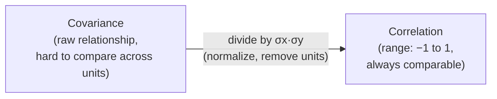

# Covariance & Correlation

> **Lecture source:** 11-Apr-2026
> Question answered: **"If one variable changes, does another variable also change — and how?"**

## TL;DR



Recall: variance/SD describe the spread of **one** column. Covariance/correlation describe how **two** columns move together.

## Covariance

$$Cov(X,Y) = \frac{\sum (x_i - \bar{x})(y_i - \bar{y})}{n-1}$$

### Sign tells you the direction of the relationship

| Covariance sign | Relationship | Example |
|---|---|---|
| **Positive (+ve)** | Directly proportional — both go up together | `live_class_attended ↑` → `completion_rate ↑` |
| **Zero (0)** | No relationship | `body_weight` vs `pandas row index` |
| **Negative (−ve)** | Inversely proportional — one up, other down | `body_weight ↑` → `running_speed ↓` |

### Worked example
| Student | Study hours (X) | Marks (Y) |
|---|---|---|
| A | 1 | 30 |
| B | 2 | 40 |
| C | 3 | 50 |
| D | 4 | 60 |

`x̄ = 2.5`, `ȳ = 45`

| Student | (X−x̄) | (Y−ȳ) | Product |
|---|---|---|---|
| A | −1.5 | −15 | 22.5 |
| B | −0.5 | −5 | 2.5 |
| C | 0.5 | 5 | 2.5 |
| D | 1.5 | 15 | 22.5 |
| | | **Σ** | **50** |

$$Cov(X,Y) = \frac{50}{4-1} = 16.67 \;\; (\text{positive} \rightarrow \text{directly proportional})$$

### The problem with covariance: units make it impossible to compare
`Cov` is measured in the product of the two variables' units (e.g. "hours × marks"), which means you **cannot** compare a covariance of 16.67 (hours vs marks) with a covariance of 10,000,000 (some variable in "large units" vs another). A bigger raw number doesn't mean a "stronger" relationship — it might just mean bigger units.

## Correlation — the fix

$$\rho = \text{correlation}(X,Y) = \frac{Cov(X,Y)}{\sigma_X \cdot \sigma_Y}$$

Dividing by the two standard deviations **normalizes** covariance — it removes the units and rescales the result to always fall in a fixed, comparable range.

$$-1 \le \rho \le 1$$

| Correlation value | Meaning |
|---|---|
| **+1** | Perfect direct/positive relationship |
| **0** | No linear relationship |
| **−1** | Perfect inverse/negative relationship |
| closer to ±1 | stronger relationship |
| closer to 0 | weaker relationship |

### Worked example (continued)
```
X: 1,2,3   Y: 30,40,50
σx = √(2/2) = 1        σy = √(200/2) = 10       Cov(X,Y) = 20/2 = 10

correlation = 10 / (1 × 10) = 1.0   → PERFECT positive correlation
```

### Comparing two relationships fairly
```
A-B correlation = 0.68
A-C correlation = 0.78   → A-C is the STRONGER relationship (closer to 1)
```
This comparison is only valid *because* correlation is unit-free — you could never safely compare raw covariances like this.

```python
import numpy as np
x = np.array([1,2,3,4])
y = np.array([30,40,50,60])

cov_matrix = np.cov(x, y)          # cov_matrix[0][1] = Cov(X,Y)
corr_matrix = np.corrcoef(x, y)    # corr_matrix[0][1] = correlation
print("Covariance:", cov_matrix[0][1])
print("Correlation:", corr_matrix[0][1])
```

### Quick-recall Q&A
- **Q: Covariance = -40. What does that tell you?**
  A: The two variables move in opposite directions (inversely proportional) — but you can't judge the *strength* of the relationship from the raw number alone.
- **Q: Why do we divide covariance by σx·σy?**
  A: To remove units and rescale to a fixed, always-comparable range of −1 to 1 (normalization).
- **Q: Correlation = 0.02. Strong or weak relationship?**
  A: Very weak — close to 0 means little to no linear relationship between the variables.
