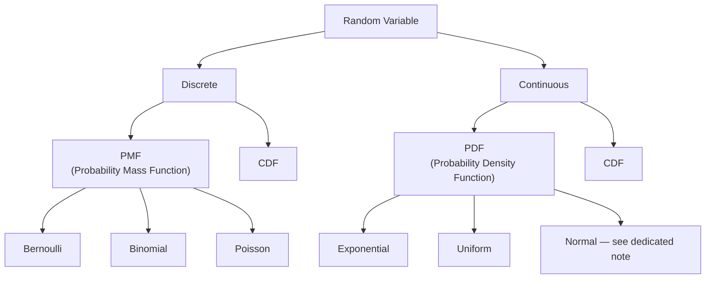

# Probability Distributions: PMF, CDF, PDF & The Named Distributions

> **Lecture source:** 08-Apr-2026, 11-Apr-2026, 12-Apr-2026

## TL;DR



## PMF — Probability Mass Function (discrete data)

> "PMF is a **function**, not just a plot." It answers: *"what's the exact chance of X happening?"*

**Example — rolling a fair die**, `P(x) = 1/6` for each face:

```python
def pmf_dice(face):
    if face in [1,2,3,4,5,6]:
        return 1/6
    else:
        return 0
```

**Rule:** `Σ P(x) = 1` (sum of all probabilities) — this only works for discrete outcomes.

## CDF — Cumulative Distribution Function (works for BOTH discrete & continuous)

Gives `P(X ≤ value)`. For discrete data it's a **step function**; for continuous data it's a **smooth curve**.

**Example — dice, `P(X ≤ 2)`:**
```
P(≤0) = 0
P(≤1) = pmf(0)+pmf(1) = 0 + 1/6
P(≤2) = pmf(0)+pmf(1)+pmf(2) = 2/6
...
P(≤6) = 6/6 = 1
```
- CDF **always** starts at 0 and ends at 1.
- `P(a ≤ X ≤ b) = CDF(b) − CDF(a)`

## PDF — Probability Density Function (continuous data only)

**Why not PMF for continuous data?** Because `P(height = exactly 160.000...cm) = 1/∞ = 0`. With infinite possible values, the probability of any *single exact point* is zero. Instead, PDF gives the probability of a **range**.

> **PDF is a density, NOT a probability.** The height of the PDF curve at a point tells you how *concentrated* probability is near that value — higher PDF = more likely to find values nearby. **Probability = the area under the curve** over a range, not the height itself.

### Building a PDF from a histogram (worked example)
Heights of 20 people, binned:

| Height (cm) | Frequency | PDF = freq / (n × bin width) |
|---|---|---|
| 150–155 | 1 | 1/(20×5) = 0.01 |
| 155–160 | 0 | 0 |
| 160–165 | 3 | 0.03 |
| 165–170 | 6 | 0.06 |
| 170–175 | 6 | 0.06 |
| 175–180 | 4 | 0.04 |

$$P(165 \le \text{height} \le 170) = \text{PDF value} \times \text{bin width} = 0.06 \times 5 = 0.30$$

**Verification:** actual data points in 165-170cm range = 6 people → 6/20 = 0.30 ✓ matches!

```python
import numpy as np
heights = np.array([162,168,171,154,175,178,165,169,172,160,
                     167,173,170,176,164,179,166,170,174,168])
hist, bin_edges = np.histogram(heights, bins=6, density=True)  # density=True → PDF
```

---

## The Named Discrete Distributions

### Bernoulli — a single yes/no trial

The simplest possible distribution: **one trial, two outcomes**.

$$P(X=x) = p^x (1-p)^{1-x}, \quad x \in \{0,1\}$$

| Parameter | Meaning |
|---|---|
| `p` | probability of success (the *only* parameter) |
| Mean | `p` |
| Variance | `p(1-p)` |

**Worked example:** 60% of customers buy shoes. `P(X=1) = 0.6` (buy), `P(X=0) = 0.4` (don't buy). Mean = 0.6, Variance = 0.6×0.4 = **0.24**.

Use cases: every coin flip, every yes/no question, every pass/fail outcome.

### Binomial — N independent Bernoulli trials

Models the number of successes across `n` repeated Bernoulli(p) trials.

$$P(X=k) = \binom{n}{k} p^k (1-p)^{n-k}, \qquad \binom{n}{k} = \frac{n!}{(n-k)!\,k!}$$

| Symbol | Meaning |
|---|---|
| `n` | total number of trials |
| `k` | exact number of successes wanted |
| `p` | success probability per trial |
| `C(n,k)` | number of ways to arrange k successes among n trials |

**Worked example:** A pizza brand's garlic dip has a 60% buy rate (`p=0.6`). 5 customers arrive today (`n=5`). What's the probability exactly 3 buy (`k=3`)?

```
C(5,3) = 5! / (2!×3!) = 10
success part:  p³ = 0.6³ = 0.216
failure part:  (1-p)^(5-3) = 0.4² = 0.16
P(X=3) = 10 × 0.216 × 0.16 = 0.3456  →  34.56%
```

```python
from scipy.stats import binom
prob = binom.pmf(k=3, n=5, p=0.6)          # exactly 3
prob_at_least_3 = 1 - binom.cdf(2, n=5, p=0.6)  # P(X >= 3)
```

### Poisson — count of rare events in a fixed interval

Models: **how many times does a rare event happen** in a fixed interval, at a constant average rate `λ`.

$$P(k) = \frac{e^{-\lambda}\lambda^k}{k!}$$

| Property | Detail |
|---|---|
| Parameter | `λ` (lambda) = average rate of events |
| Independence | events occur independently of each other (one event doesn't make the next more/less likely) |
| Examples | website visits/minute, customer service calls/hour |

> Note: "memoryless" (`P(T>s+t \| T>s) = P(T>t)`) is technically a property of the **Exponential** distribution (see below), not Poisson itself. What Poisson assumes is *independent* events at a constant rate — that assumption is what gives rise to the memoryless waiting time between events.

**Worked example:** A website averages 4 visits/hour (`λ=4`). What's `P(exactly 6 visits in an hour)`?
```
P(6) = e⁻⁴ × 4⁶ / 6!  ≈  0.1042
```

```python
from scipy.stats import poisson
prob = poisson.pmf(k=6, mu=4)
```

---

## The Named Continuous Distributions

### Uniform — every value equally likely

$$f(x) = \frac{1}{b-a}, \qquad a \le x \le b$$

The PDF is a **flat rectangle**: `width = b−a`, `height = 1/(b−a)` (so total area = 1).

**Worked example:** A delivery arrives uniformly at random between minute 20 and minute 30 → `X ~ Uniform(20,30)`. What's `P(22 ≤ X ≤ 25)`?
```
height = 1/(30-20) = 0.1
width = 25-22 = 3
P = width × height = 3 × 0.1 = 0.3  →  30%
```

```python
from scipy.stats import uniform
prob = uniform.cdf(25, loc=20, scale=10) - uniform.cdf(22, loc=20, scale=10)
```

### Exponential — waiting time until the next (Poisson) event

**Poisson asks:** "how many events happen in fixed time?" **Exponential asks:** "how much time until the next event?" — they're two sides of the same coin.

$$P(T \le t) = 1 - e^{-\lambda t}$$

**Worked example:** Server gets 3 requests/minute on average (`λ=3/min = 0.05/sec`). What's the probability the next request comes within 10 seconds?
```
P(T ≤ 10) = 1 - e^(-0.05×10) = 1 - e^(-0.5) ≈ 0.393  →  ~39.3% chance
```

**Second example:** A server crashes on average 0.1 times/day (`λ=0.1`). Probability it survives more than 10 days without crashing?
```
P(crash within 10 days) = 1 - e^(-0.1×10) = 1 - e⁻¹ ≈ 0.6321
P(NO crash in 10 days) = 1 - 0.6321 = 0.3679  → ~36.8% chance of surviving 10 days
```

```python
from scipy.stats import expon
lam = 0.05
p_within_10s = expon.cdf(10, scale=1/lam)   # scale = 1/lambda
```

## Distribution cheat sheet

| Distribution | Type | Models | Key parameter |
|---|---|---|---|
| **Bernoulli** | Discrete | Single yes/no trial | `p` |
| **Binomial** | Discrete | # successes in n trials | `n`, `p` |
| **Poisson** | Discrete | # rare events in fixed time | `λ` |
| **Uniform** | Continuous | Every value in a range equally likely | `a`, `b` |
| **Exponential** | Continuous | Time until next event | `λ` |
| **Normal** | Continuous | Bell-curve, natural phenomena | `μ`, `σ` (see [09-normal-distribution-zscore.md](09-normal-distribution-zscore.md)) |

### Quick-recall Q&A
- **Q: What's the difference between PMF and PDF?**
  A: PMF gives the exact probability of a discrete value (`P(X=x)`); PDF gives a *density* for continuous data — probability only comes from the area under the curve over a range, not a single point.
- **Q: You want to know "how many customer calls in the next hour" — which distribution?**
  A: Poisson (count of rare/random events in a fixed interval).
- **Q: You want to know "how long until the next customer call" — which distribution?**
  A: Exponential (waiting time until the next Poisson event).
- **Q: Binomial with n=1 — what does it reduce to?**
  A: Bernoulli — binomial is just n repeated Bernoulli trials, and n=1 is a single trial.
