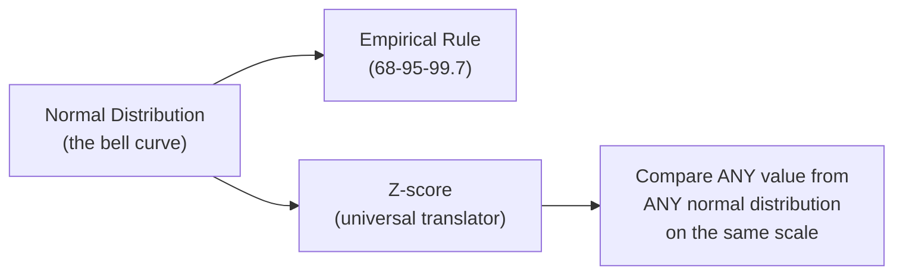
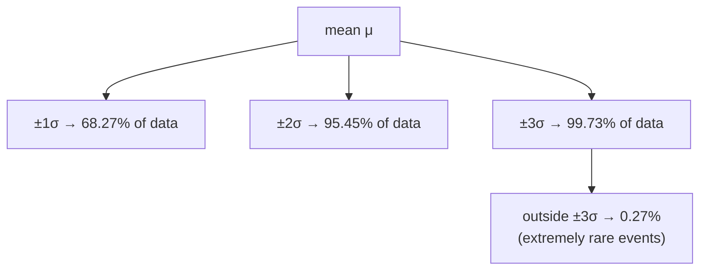

# Normal Distribution, Empirical Rule & Z-Score

> **Lecture source:** 15-Apr-2026, 18-Apr-2026

## TL;DR



## Normal (Gaussian) Distribution

The classic bell-shaped curve: **symmetric, continuous**, probability concentrated near the mean, extreme values rare.

$$X \sim N(\mu, \sigma^2)$$

| Component | Meaning |
|---|---|
| `μ` | mean (location — center of the bell) |
| `σ` | standard deviation (spread — width of the bell) |
| `σ²` | variance |

**Key property:** in a perfectly normal distribution, **mean = median = mode**.

PDF formula:
$$f(x) = \frac{1}{\sigma\sqrt{2\pi}} \, e^{-\frac{(x-\mu)^2}{2\sigma^2}}$$

Real-world examples: human height, exam scores, average age — "average values happen often, extreme values happen rarely."

## The Empirical Rule (68-95-99.7 Rule)



| Range | % of data captured |
|---|---|
| μ ± 1σ | 68.27% |
| μ ± 2σ | 95.45% |
| μ ± 3σ | 99.73% |
| μ ± 4σ | 99.9937% |
| μ ± 5σ | 99.99994% |
| μ ± 6σ | 99.9999998% |

**Worked example:** Exam scores `X ~ N(70, 10²)` (mean=70, SD=10). What's `P(60 ≤ X ≤ 80)`?
```
z-lower = (60-70)/10 = -1
z-upper = (80-70)/10 = +1
P(-1 ≤ Z ≤ 1) = 68.27%   ← straight from the empirical rule (±1σ)
```

**Second example:** `P(student scores above 90)`?
```
z = (90-70)/10 = 2   → 2 SD above the mean
```
Only ~2.28% of students score above +2σ (each tail beyond ±2σ holds `(100-95.45)/2 = 2.28%`).

## Z-Score — "the universal translator"

> A z-score tells you **how many standard deviations a value is from the mean.** It converts *any* value from *any* normal distribution into a common, comparable scale.

$$z = \frac{x - \mu}{\sigma}$$

### Why raw distance alone is misleading
| Exam | Mean | SD | Your score | Raw distance | Z-score |
|---|---|---|---|---|---|
| Exam A | 70 | 5 | 80 | 10 | **z = 2** → 2 SD away (rare, impressive) |
| Exam B | 70 | 20 | 80 | 10 | **z = 0.5** → 0.5 SD away (unremarkable) |

Same raw score (80) and same raw distance (10) from the mean — but wildly different meaning once you account for spread! **SD gives context that raw numbers can't.**

### Worked example
Student scored 85, class mean = 70, SD = 10:
```
z = (85 - 70) / 10 = 1.5   → 1.5 SD above average
```

Compare scores in two *different* subjects:
```
History: scored 85, mean=70   → clearly above avg
Math:    scored 85, mean=90   → below avg, even though raw score is identical!
```
This is exactly why z-scores matter — they let you compare apples to oranges (different means, different spreads) on one common scale.

```python
from scipy.stats import norm

z = (85 - 70) / 10          # manual z-score
p_less_than_x = norm.cdf(z) # area to the left of z → percentile
print(f"z={z}, percentile={p_less_than_x:.4f}")   # z=1.5 → ~93.3%
```

### Reading the Z-table
The z-table gives you the **area under the curve to the left of z** (i.e. `P(Z ≤ z)`), which is a probability/percentile.

**Worked example:** height `μ=150cm`, `σ=10cm`, someone is `170cm` tall.
```
z = (170-150)/10 = 2
z-table lookup for z=2.0 → 0.9772 → 97.72%
```
→ this person is taller than ~97.72% of the population.

### Quick-recall Q&A
- **Q: Why can't you compare two raw scores from different distributions directly?**
  A: Because the distributions may have different means and spreads — a z-score normalizes both scores onto the same scale (SD units from their own mean) so they become comparable.
- **Q: z = -1.5. What does the negative sign mean?**
  A: The value is *below* the mean (1.5 standard deviations below it).
- **Q: What % of data lies beyond ±3σ in a normal distribution?**
  A: 0.27% — these are the extremely rare, "unusual" values.
