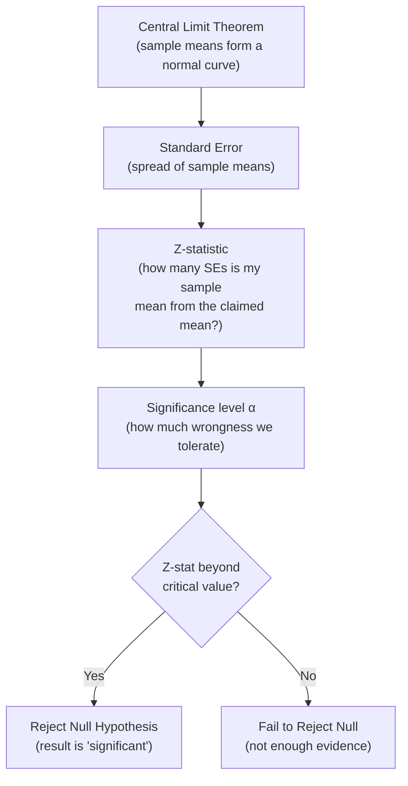
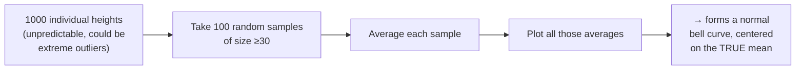
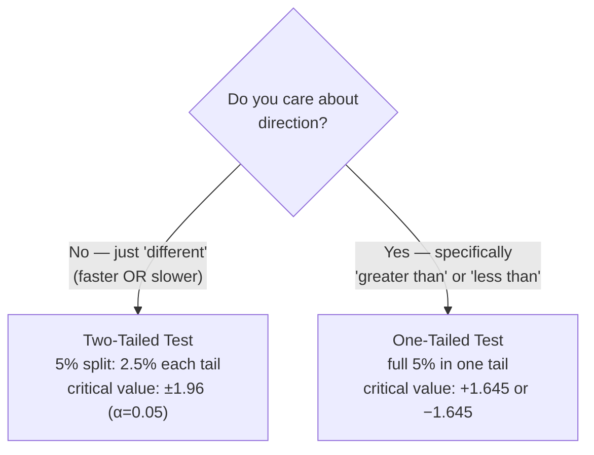
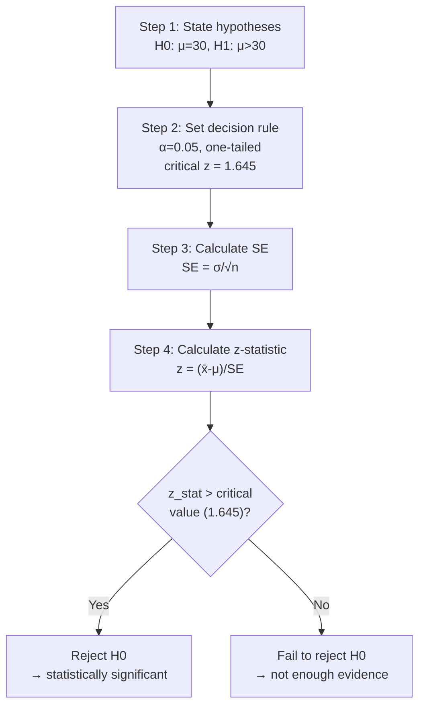

# Central Limit Theorem, Standard Error & Hypothesis Testing

> **Lecture source:** 18-Apr-2026
> This is the capstone topic — everything else in this repo (mean, SD, z-score, normal distribution) feeds into this: **how do we scientifically decide if a claim is true using sample data?**

## TL;DR — the full pipeline



## Central Limit Theorem (CLT)

Individual data points can be wildly unpredictable (an individual student might be extremely short or tall). But:

> **If you repeatedly sample groups (n ≥ 30) and take each group's average, those group averages will form a normal distribution centered on the true population mean — even if the original data isn't normal.**



**Rule of thumb:** sample size `n ≥ 30` is generally considered large enough for CLT to kick in.

## Standard Error (SE) — the spread of sample means

| | Standard Deviation (SD) | Standard Error (SE) |
|---|---|---|
| Measures spread of | **individual** data points from the mean | **group averages** from the true mean |
| Question answered | "How much do single data points vary?" | "How much do averages of samples vary?" |
| Formula | `σ` | `σ / √n` |

$$SE = \frac{\sigma}{\sqrt{n}}$$

**Worked example:** 25 students, population SD = 10cm.
```
SE = 10 / √25 = 10/5 = 2
```
Notice: SE (2) < SD (10) — averages are always *less* spread out than individual points, and SE shrinks further as sample size `n` grows.

## Z-score vs. Z-statistic — don't mix these up

| | Z-score | Z-statistic |
|---|---|---|
| Measures | how far ONE data point is from the mean | how far a SAMPLE MEAN is from the population mean |
| Formula | `z = (x - μ) / σ` | `z = (x̄ - μ) / SE = (x̄ - μ) / (σ/√n)` |
| Units | standard deviations | standard errors |

$$z_{stat} = \frac{\bar{x} - \mu}{SE} = \frac{\bar{x} - \mu}{\sigma/\sqrt{n}}$$

### Worked example
Claim: "energy drink has 200mg caffeine on average" (`μ=200`, `σ=10`).
Evidence: sample of 40 cans, sample mean `x̄ = 198mg`.

```
SE = 10/√40 ≈ 1.581
z_stat = (198 - 200) / 1.581 ≈ -1.265
```
→ the sample mean is only **1.265 standard errors** below the claimed mean — not "weird enough" to prove the company is lying. Likely just random sampling variation.

---

## Significance Level (α) & Confidence Level

> **Significance level (α)** = the probability of rejecting a true claim (your tolerance for being wrong). It's a "math rule" version of "this is too unlikely to be luck."

| α (significance) | Confidence level | Two-tailed critical z-value |
|---|---|---|
| 0.10 (10%) | 90% | ±1.645 |
| 0.05 (5%) | 95% | ±1.96 |
| 0.01 (1%) | 99% | ±2.58 |

> α = 0.05 means: "we're okay with being wrong 5% of the time."

### One-tailed vs. Two-tailed tests



| Test type | When to use | Example claim |
|---|---|---|
| **Two-tailed** | You only care *if* something changed, not which direction | "Is the average delivery time different from 30 min?" |
| **One-tailed** | You specifically claim a direction | "Customers claim deliveries are *slower* than 30 min" |

---

## Hypothesis Testing — the full framework

> Analogy from the notes: like a courtroom — **innocent until proven guilty.**

| | Meaning |
|---|---|
| **Null Hypothesis (H₀)** | the "innocent"/default state — "everything is normal," nothing has changed |
| **Alternate Hypothesis (H₁)** | the "accusation" — "something has changed" |

### Step-by-step worked example

**Claim (H₀):** average delivery time `μ = 30` minutes.
**Accusation (H₁):** customers say deliveries are slower → `μ > 30` (one-tailed).

**Evidence:** sample of 36 deliveries (`n=36`), sample mean `x̄ = 31` min, population SD `σ = 4` min, `α = 0.05`.



**Step 3 — Standard Error:**
$$SE = \frac{\sigma}{\sqrt{n}} = \frac{4}{\sqrt{36}} = 0.6667$$

**Step 4 — Z-statistic:**
$$z_{stat} = \frac{31 - 30}{0.6667} \approx 1.50$$

**Step 5 — Decision:** Is `1.50 > 1.645` (the one-tailed critical value)? **No.** → **Fail to reject H₀.**

**Conclusion:** "Even though the average was 31 minutes, a sample of 36 is small enough that this could just be a bad week by random chance. We don't have enough proof to call the company out."

```python
from scipy import stats
import numpy as np

mu, sigma, n, x_bar = 30, 4, 36, 31
se = sigma / np.sqrt(n)
z_stat = (x_bar - mu) / se

alpha = 0.05
critical_z = stats.norm.ppf(1 - alpha)   # one-tailed critical value ≈ 1.645

print(f"z_stat={z_stat:.2f}, critical={critical_z:.3f}")
print("Reject H0" if z_stat > critical_z else "Fail to reject H0")
```

---

## P-value — the other way to decide

> **P-value = how "rare" your result is, assuming the null hypothesis is true.** Lower p-value = rarer result = stronger evidence against H₀.

$$\text{Decision rule: if } p\text{-value} < \alpha, \text{ reject } H_0$$

### Worked example (same delivery scenario, one-tailed)
```
z_stat = 1.50
Area to the left of z=1.50 (from z-table) = 0.9332
p-value = 1 - 0.9332 = 0.0668

compare: 0.0668 vs α=0.05
0.0668 > 0.05  →  FAIL TO REJECT H0
```
**Interpretation:** "There's a 6.68% chance that a 31-minute average delivery time was just a random fluke — not rare enough (below our 5% bar) to call it statistically significant."

```python
p_value = 1 - stats.norm.cdf(z_stat)
print(f"p-value = {p_value:.4f}")
print("Reject H0" if p_value < alpha else "Fail to reject H0")
```

## Cheat sheet: which formula, when?

| I want to... | Use |
|---|---|
| See how far ONE point is from the mean | Z-score: `(x-μ)/σ` |
| See how spread out sample AVERAGES are | Standard Error: `σ/√n` |
| See how far my SAMPLE MEAN is from the claimed population mean | Z-statistic: `(x̄-μ)/SE` |
| Decide if a result is "weird enough" to matter | Compare z-stat to critical value **or** p-value to α |

### Quick-recall Q&A
- **Q: In one sentence, what does the Central Limit Theorem say?**
  A: Averages of repeated samples (n≥30) form a normal distribution around the true population mean, even if the raw data isn't normally distributed.
- **Q: SE = 2, SD = 10. Which is bigger and why?**
  A: SD is bigger — SD measures spread of individual points, SE measures spread of sample *averages*, and averaging always reduces variability (`SE = σ/√n`).
- **Q: p-value = 0.03, α = 0.05. Reject or fail to reject H0?**
  A: Reject H0 — p-value < α means the result is rare enough (only 3% likely under H0) to be considered statistically significant.
- **Q: Why is hypothesis testing described as "innocent until proven guilty"?**
  A: H0 (the default/status quo) is assumed true until the evidence (z-stat/p-value) is extreme enough to reject it — you don't need to prove H0 true, just fail to find enough evidence against it.
