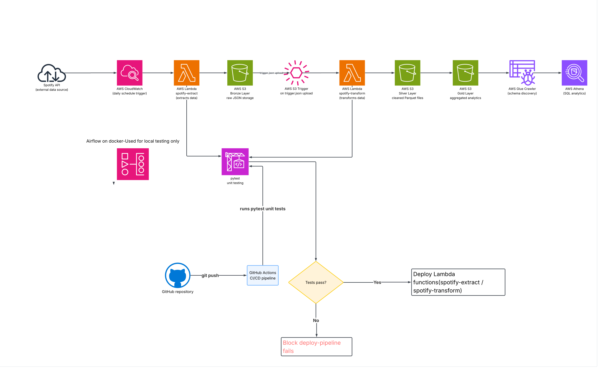

# 🎵 Spotify Data Pipeline


A production-grade serverless data pipeline that extracts daily music data 
from the Spotify API and transforms it through a Bronze → Silver → Gold 
medallion architecture on AWS.

---

## Overview

This pipeline automatically extracts 50+ tracks daily across 5 music genres 
from the Spotify Search API, transforms the raw data through multiple quality 
layers, and surfaces analytical insights via Amazon Athena SQL queries.

**Key highlights:**
- Serverless AWS Lambda deployment with zero infrastructure management
- Medallion architecture (Bronze/Silver/Gold) on Amazon S3
- Automated daily scheduling via CloudWatch EventBridge
- Data quality framework with null checks, deduplication, and freshness validation
- Full test coverage with pytest, MagicMock, and mock S3/API testing
- CI/CD pipeline via GitHub Actions with automatic Lambda deployment

---

## Architecture



### Production (AWS Serverless):
```
CloudWatch (daily) → Lambda Extract → S3 Bronze
                                           ↓ (S3 trigger)
                                    Lambda Transform → S3 Silver → S3 Gold
                                                                      ↓
                                                              Glue Crawler → Athena
```

### Local Development:
```
Apache Airflow (Docker) → Full Pipeline → S3 Bronze/Silver/Gold
```

---

##  Tech Stack

| Category | Technologies |
|----------|-------------|
| Language | Python 3.12 |
| Cloud | AWS Lambda, S3, Glue, Athena, CloudWatch, IAM |
| Orchestration | Apache Airflow (Docker) |
| Data Format | Parquet (Bronze/Silver/Gold) |
| Testing | pytest, MagicMock, patch, conftest |
| CI/CD | GitHub Actions |
| Libraries | Pandas, NumPy, PyArrow, Pydantic, Requests |

---

##  Pipeline Flow

### Extract Lambda (`lambda_extract.py`)
1. Authenticates with Spotify API using Client Credentials flow
2. Searches across 5 genres (hip-hop, pop, rock, jazz, electronic)
3. Extracts artists, albums, and tracks data
4. Saves raw JSON to S3 Bronze layer (date-partitioned)
5. Saves `trigger.json` to signal Transform Lambda

### Transform Lambda (`lambda_transform.py`)
1. Triggered automatically by S3 PUT event on `trigger.json`
2. Reads Bronze JSON → applies transformations
3. Saves cleaned Parquet files to S3 Silver layer
4. Builds Gold layer aggregations:
   - `top_artists` — artist track counts and explicit content analysis
   - `album_stats` — album metrics by release decade
   - `explicit_analysis` — content category distribution

---

## 📁 Project Structure

```
spotify-pipeline/
├── src/spotify_pipeline/
│   ├── config.py              # Pydantic settings management
│   ├── extract/               # Spotify API extraction
│   │   ├── auth.py            # OAuth2 client credentials
│   │   ├── artists.py         # Artist extraction
│   │   ├── albums.py          # Album extraction
│   │   └── tracks.py          # Track extraction
│   ├── transform/             # Silver layer transformations
│   │   ├── artists.py
│   │   ├── albums.py
│   │   ├── tracks.py
│   │   └── quality.py         # Data quality checks
│   ├── gold/                  # Gold layer aggregations
│   │   ├── top_artists.py
│   │   ├── album_stats.py
│   │   ├── explicit_analysis.py
│   │   └── save_gold.py
│   ├── load/
│   │   └── s3.py              # S3 operations (Bronze/Silver/Gold)
│   └── utils/
│       ├── logger.py          # Structured JSON logging
│       ├── decorators.py      # @retry, @log_execution
│       └── spotify_client.py  # Multi-genre search client
├── lambda_extract.py          # AWS Lambda Extract handler
├── lambda_transform.py        # AWS Lambda Transform handler
├── airflow/dags/              # Airflow DAG (local orchestration)
├── tests/                     # pytest test suite
│   ├── conftest.py
│   ├── test_auth.py
│   ├── test_extract.py
│   ├── test_load.py
│   ├── test_transform.py
│   └── test_quality.py
└── .github/workflows/ci.yml  # GitHub Actions CI/CD
```

---

## Running Locally

### Prerequisites
- Python 3.12
- Docker Desktop
- AWS credentials
- Spotify API credentials

### Setup

```bash
# Clone repo
git clone https://github.com/andru98/Andrina-Study-Journal.git
cd projects/spotify-pipeline

# Create virtual environment
python -m venv .venv
source .venv/bin/activate

# Install dependencies
pip install -e ".[dev]"

# Create .env file
cp .env.example .env
# Add your Spotify and AWS credentials
```

### Run pipeline locally

```bash
python src/spotify_pipeline/main.py
```

### Run with Airflow (Docker)

```bash
cd learning/airflow-learning
docker compose start
# Open http://localhost:8080 (airflow/airflow)
# Trigger spotify_pipeline DAG
```

### Run tests

```bash
pytest tests/ -v
```

---

## ☁️ AWS Deployment

### Architecture
- **Extract Lambda**: Triggered daily by CloudWatch EventBridge (`rate(1 day)`)
- **Transform Lambda**: Triggered by S3 PUT event on `bronze/trigger/` prefix
- **S3 Buckets**: `spotify-raw-anna-2026` (Bronze) + `spotify-transform-anna-2026` (Silver/Gold)
- **Glue Crawler**: Auto-discovers schema from Gold Parquet files
- **Athena**: SQL analytics on Gold layer via `spotify_analytics` database

### IAM
Both Lambda functions use IAM execution roles with `AmazonS3FullAccess` — 
credentials injected automatically via IAM role (no hardcoded keys).

---

## Data Quality

Quality checks run on every Silver layer transformation:

| Check | Description |
|-------|-------------|
| Null check | Validates required fields (artist_id, track_id, album_id) |
| Duplicate detection | Removes duplicate records by primary key |
| Row count threshold | Alerts if fewer than 10 records extracted |
| Freshness check | Validates data is from current pipeline run |

---

## Athena Queries

Four portfolio-worthy analytical queries available in `spotify_analytics` database:

```sql
-- Artist market share
SELECT artist_name, track_count,
    ROUND(track_count * 100.0 / SUM(track_count) OVER (), 2) AS market_share_pct
FROM top_artists ORDER BY track_count DESC LIMIT 10;

-- Album release trends by decade
SELECT FLOOR(release_year/10)*10 AS decade,
    COUNT(*) AS album_count,
    ROUND(AVG(avg_duration_seconds), 0) AS avg_duration_secs
FROM album_stats WHERE release_year > 0
GROUP BY 1 ORDER BY 1 DESC;

-- Explicit content distribution
SELECT total_tracks, explicit_count, clean_count, ROUND(explicit_pct, 2) AS explicit_pct
FROM explicit_analysis;

-- Top artists by explicit content
SELECT artist_name, track_count, explicit_count, ROUND(explicit_pct, 2) AS explicit_pct
FROM top_artists WHERE track_count > 1
ORDER BY explicit_pct DESC LIMIT 10;
```

---

## Testing

```bash
pytest tests/ -v
```

Test coverage includes:
- **test_auth.py** — Spotify OAuth2 token flow (mocked HTTP)
- **test_extract.py** — Artist/album/track extraction logic
- **test_load.py** — S3 Bronze/Silver/Gold save operations (mock S3)
- **test_transform.py** — Data transformation and cleaning
- **test_quality.py** — Data quality check validation

---

## 👤 Author

**Andrina Shrestha**  
[LinkedIn](https://linkedin.com/in/andrina2231) | [GitHub](https://github.com/andru98)